# DQN Navigation Agent
### Autonomous 2D Navigation with Double DQN and Curriculum Learning

---

## Project Structure

```
ProjectWorkAgents/
│
├── src/
│   ├── config.py             # All hyperparameters (centralised)
│   ├── environment.py        # 2D environment, LiDAR, physics, pygame rendering
│   ├── network.py            # QNetwork: Standard DQN or Dueling DQN
│   ├── agent.py              # Double DQN, ReplayBuffer, soft update, checkpoint
│   ├── train.py              # Curriculum training, MetricsLogger
│   ├── evaluate.py           # Greedy evaluation with fixed seed
│   ├── evaluate_shapes.py    # Zero-shot test on unseen obstacle shapes
│   ├── obstacle_shapes.py    # Rect, RotatedRect, Triangle, L-Shape w/ ray casting
│   ├── run_experiments.py    # Automated ablation suite
│   ├── plot_metrics.py       # Plot generation
│   └── metrics_logger.py     # Per-episode CSV logger
│
├── checkpoints/
│   ├── ablation_rays_4r/
│   │   └── best.pt
│   ├── ablation_rays_8r/
│   │   └── best.pt
│   ├── ablation_rays_16r/
│   │   └── best.pt
│   ├── ablation_rays_32r/
│   │   └── best.pt
│   ├── ablation_standard_dqn/
│   │   └── best.pt
│   └── ablation_dueling/
│       └── best.pt
│
├── results/
│   ├── ablation_rays.json
│   ├── ablation_obstacles.json
│   ├── ablation_noise.json
│   ├── ablation_stepsize.json
│   ├── shapes_eval.json
│   ├── dueling_vs_dqn.json
│   ├── ablation_rays_4r/
│   │   └── metrics.csv
│   ├── ablation_rays_8r/
│   │   └── metrics.csv
│   ├── ablation_rays_16r/
│   │   └── metrics.csv
│   ├── ablation_rays_32r/
│   │   └── metrics.csv
│   ├── ablation_standard_dqn/
│   │   └── metrics.csv
│   └── ablation_dueling/
│       └── metrics.csv
│
├── plots/
│   ├── 00_dashboard.png
│   ├── 01_learning_curve.png
│   ├── 02_loss_qvalue.png
│   ├── 03_epsilon.png
│   ├── 04_steps.png
│   ├── 05_ablation_rays.png
│   ├── 06_q_divergence.png
│   ├── 07_ablation_obstacles.png
│   ├── 08_ablation_noise.png
│   ├── 09_ablation_stepsize.png
│   ├── 10_shapes_eval.png
│   ├── 11_dueling_vs_dqn.png
│   └── 12_summary_all.png
│
├── example_gif/
│   ├── ablation_rays/
│   │   ├── rays_4r.gif
│   │   ├── rays_8r.gif
│   │   ├── rays_16r.gif
│   │   └── rays_32r.gif
│   ├── ablation_obstacles/
│   │   ├── obstacles_02.gif
│   │   ├── obstacles_04.gif
│   │   ├── obstacles_06.gif
│   │   ├── obstacles_08.gif
│   │   ├── obstacles_10.gif
│   │   └── obstacles_12.gif
│   ├── ablation_noise/
│   │   ├── noise_00.gif
│   │   ├── noise_002.gif
│   │   ├── noise_005.gif
│   │   ├── noise_01.gif
│   │   └── noise_02.gif
│   └── ablation_step/
│       ├── step_4px.gif
│       ├── step_6px.gif
│       ├── step_8px.gif
│       ├── step_12px.gif
│       └── step_16px.gif
│
└── requirements.txt
```

---

## Table of Contents
1. [Introduction](#1-introduction)
2. [Problem Description](#2-problem-description)
3. [System Architecture](#3-system-architecture)
4. [Learning Algorithm](#4-learning-algorithm)
5. [Curriculum Learning](#5-curriculum-learning)
6. [Training Challenges and Solutions](#6-training-challenges-and-solutions)
7. [Experiments and Ablation Study](#7-experiments-and-ablation-study)
8. [Results](#8-results)
9. [Conclusions](#9-conclusions)
10. [Usage](#10-usage)
11. [References](#11-references)

---

## 1. Introduction

This project implements an autonomous agent that learns to navigate a continuous 2D environment using **Reinforcement Learning**. The agent must reach a goal while avoiding randomly placed circular obstacles, with no access to a global map — it perceives only its immediate surroundings through simulated LiDAR sensors.

The study covers how variants of the DQN algorithm and different perceptual configurations affect navigation performance, through a complete ablation study on:

- Effect of the number of LiDAR rays (perceptual information available)
- Comparison between Dueling DQN and Standard DQN architectures
- Robustness to variations in obstacle density, sensor noise and step size
- Zero-shot generalisation to obstacle shapes never seen during training

---

## 2. Problem Description

### Environment

A continuous 2D canvas of 600×600 pixels:

- **Agent**: circle of radius 10 px, moves in float coordinates
- **Goal**: fixed circle of radius 28 px, success zone at 38 px
- **Obstacles**: circles randomly generated each episode (radius 20–45 px)
- **Termination**: goal reached (+10), collision (−1), timeout after 400 steps

```
┌─────────────────────────────────────┐
│                                     │
│  [A]─────────────────────►[G]       │
│        ⬤    ⬤   ⬤                  │
│     ⬤           ⬤    ⬤             │
│                                     │
│  A = Agent (10px)   G = Goal (28px) │
│  ⬤ = Obstacle (20–45px)             │
└─────────────────────────────────────┘
```

### State Space — vector of `3 + N_RAYS + 8` dimensions

```
[sin θ, cos θ, dist_norm]   →  direction and normalised distance to goal
[r₀, r₁, …, r_{N-1}]       →  N LiDAR rays in [0,1]  (0=near obstacle, 1=free)
[a₀, a₁, …, a₇]            →  last action taken (one-hot encoding)
```

With N_RAYS=16 (default configuration): STATE_DIM = **27**. Direction is encoded as (sin θ, cos θ) rather than a raw angle to provide a continuous, periodic-safe representation for the network.

### Action Space — 8 discrete actions

```
0: Up    1: Down    2: Right    3: Left
4: ↗     5: ↘       6: ↙        7: ↖
```

All actions travel the same Euclidean distance (8 px). Diagonals use `8/√2 ≈ 5.66 px` per component. **Wall sliding** is implemented: if a diagonal collides, the system attempts the X and Y components independently before declaring a terminal collision.

### Reward Function

```
+10.0   goal reached
 −1.0   obstacle collision (terminal)
−0.003  time penalty per step  (efficiency incentive)
+0.08 × (prev_dist − curr_dist) / max_dist   only within 100px of goal
```

The proximity reward is **local** (active only within 100 px of the goal) to avoid penalising detours required to navigate around obstacles.

---

## 3. System Architecture

### LiDAR — Analytic Ray Casting

The system uses **analytic** ray casting: it solves the exact ray–circle/segment intersection equation in O(1) per obstacle. Each ray returns a normalised distance in [0, 1] where `0 = obstacle at contact` and `1 = maximum range (300 px)`. This approach is both precise and computationally efficient compared to stepping-based methods.

### Neural Network — Standard DQN

```
Input(STATE_DIM)
    │
    ▼
Linear(256) → ReLU → Linear(128) → ReLU → Linear(8)
                                               │
                                          Q(s, a₀…a₇)
```

Standard DQN was selected over Dueling DQN based on experimental evidence (Section 7.1): Standard DQN achieves SR=91.5% against SR=51.5% for Dueling DQN. The advantage stream in Dueling DQN introduces additional variance in the Q-value estimate that amplifies the bootstrap loop in this task.

---

## 4. Learning Algorithm

### Double DQN

Separates action selection (online net) from action evaluation (target net) to reduce overestimation bias:

```
a* = argmax_a Q_online(s', a)
y  = r + γ · Q_target(s', a*) · (1 − done)
L  = HuberLoss(Q_online(s, a), y)
```

**Target network — Soft (Polyak) update:**
```
θ_target ← τ · θ_online + (1−τ) · θ_target    τ = 0.005
```

### Key Hyperparameters

| Parameter | Value | Notes |
|-----------|-------|-------|
| `HIDDEN1 / HIDDEN2` | 256 / 128 | MLP architecture |
| `LR` | scaled by N_RAYS | See ablation table |
| `GAMMA` | 0.99 | Discount factor |
| `BATCH_SIZE` | 128 | Mini-batch |
| `REPLAY_BUFFER_SIZE` | 50,000 | Transitions |
| `TAU` | scaled by N_RAYS | Soft update |
| `EPS_START / EPS_END` | 1.0 / 0.10 | Exploration range |
| `EPS_DECAY` | 0.997 / ep | Multiplier per episode |
| `GRAD_CLIP` | 0.5 | Gradient clipping |

---

## 5. Curriculum Learning

### The Cold-Start Problem

Direct training with 8 random obstacles from episode 0 does not converge. The replay buffer fills exclusively with negative experiences (collisions and timeouts) and the network never sees the +10 reward signal. Without this positive feedback, learning "move toward the goal" cannot take place.

### Curriculum Structure

| Phase | Episodes | Agent Spawn | Goal Spawn | Obstacles | Objective |
|-------|----------|-------------|------------|-----------|-----------|
| **0** | 500 | Fixed (80,300) | Fixed (520,300) | 0 | Learn "move toward goal" |
| **1** | 1500 | Fixed | Fixed | 2→8 growing | Learn obstacle avoidance |
| **1.5** | 400–700 | **Random** | Fixed | 8 fixed | Bridge distribution shift |
| **2** | 3000 | Random | Random | 8 random | Full generalisation |

### Phase 1.5 — Methodological Contribution

Phase 1.5 is a transition phase that solves the **distribution shift** problem: the direct jump from fixed positions (Phase 1) to fully random positions (Phase 2) causes systematic Q-value divergence, especially with larger networks (16–32 rays).

In Phase 1.5 the agent starts from random positions but the goal remains fixed, creating a gradual bridge between the two distributions:

```
Phase 1:   Fixed agent   →  Fixed goal    (fully memorised)
Phase 1.5: Random agent  →  Fixed goal    (half randomised)
Phase 2:   Random agent  →  Random goal   (fully generalised)
```

During Phase 1.5, the Standard DQN (16r) Q-value dropped from 45 to 4 in 600 episodes, resetting the network from Phase 1 memorisation before tackling full generalisation.

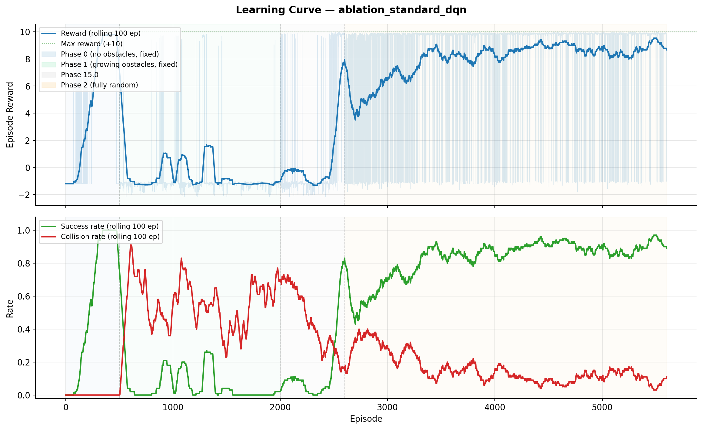
*Learning curve — success rate and reward during training. Coloured bands indicate curriculum phases.*

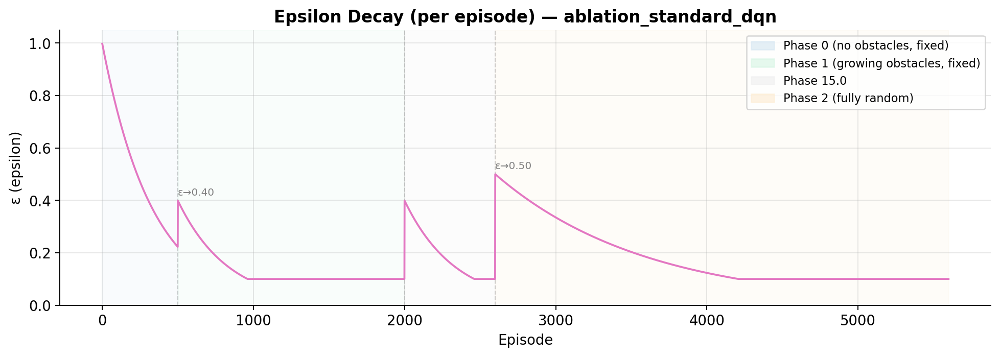
*Epsilon decay with resets at each phase transition.*

---

## 6. Training Challenges and Solutions

### 6.1 Q-Value Divergence (Deadly Triad)

In Phase 2, Q-values grew exponentially to 10⁶ in all initial configurations. The combination of function approximation + bootstrapping + off-policy learning (the "deadly triad" in RL) becomes unstable when ε hits its minimum value, causing the replay buffer to fill with increasingly poor experiences.

| Fix | Root cause | Effect |
|-----|-----------|--------|
| `EPS_END = 0.10` | ε too low → poisoned buffer | Permanent 10% exploration |
| Buffer clear at Phase 2 | Buffer full of Phase 1 data | Clean distribution |
| Optimizer reset | Wrong Adam momentum | Correct gradients |
| `GRAD_CLIP = 0.5` | Exploding gradients | Bounded amplification |
| Phase 1.5 | Abrupt distribution shift | Gradual transition |

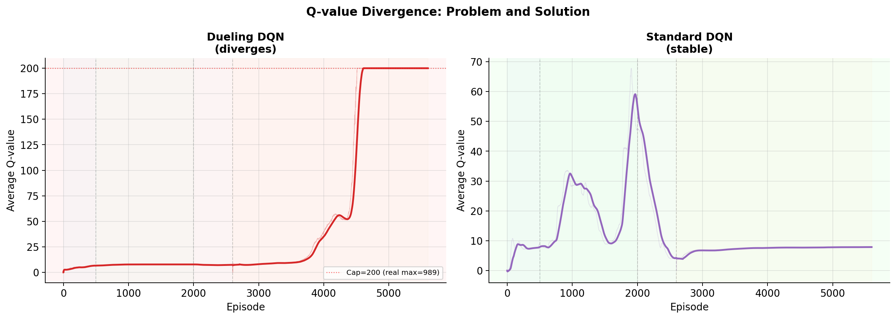
*Q-value divergence: Dueling DQN (Q→10⁶, left) vs stable Standard DQN (Q~7–8, right).*

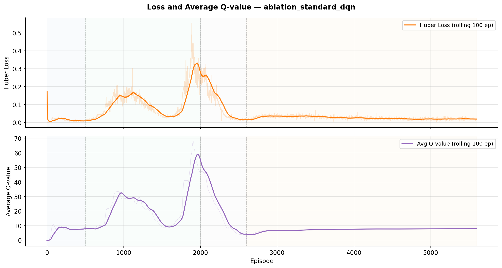
*Huber Loss and average Q-value during training — stable throughout all phases.*

### 6.2 LR Scaled by Dimensionality

With more LiDAR rays the state space is larger. With 43 dimensions (32 rays) the gradients through the shared trunk are proportionally larger, causing instability even with gradient clipping. The learning rate is scaled inversely with N_RAYS:

| N Rays | State dim | LR | Phase 0 | TAU |
|--------|-----------|-----|---------|-----|
| 4  | 15 | 5×10⁻⁴ | 500 ep  | 0.005 |
| 8  | 19 | 3×10⁻⁴ | 600 ep  | 0.003 |
| 16 | 27 | 2×10⁻⁴ | 800 ep  | 0.002 |
| 32 | 43 | 1×10⁻⁴ | 1000 ep | 0.001 |

---

## 7. Experiments and Ablation Study

All evaluations use **200 episodes with fixed seed (42)**.

### 7.1 Architecture: Standard DQN vs Dueling DQN

| Architecture | SR | CR | TR | Avg Steps | Avg Reward |
|---|---|---|---|---|---|
| **Standard DQN** | **91.5%** | 4.0% | 4.5% | 57.2 | 8.94 |
| Dueling DQN | 51.5% | 18.0% | 30.5% | 146.4 | 4.53 |

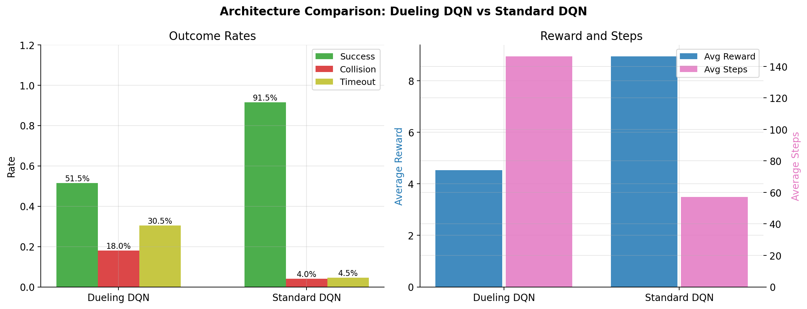
*Standard DQN outperforms Dueling DQN by 40 percentage points.*

The Dueling DQN diverges systematically in Phase 2 (Q→989 at ep 5100). The Standard DQN remains stable for the full training duration with Q between 3.8 and 7.9.

### 7.2 Ablation: Number of LiDAR Rays

| N Rays | State Dim | SR | CR | TR | Avg Steps | Avg Reward |
|--------|-----------|-----|-----|-----|-----------|------------|
| 4  | 15 | 75.0% | 13.0% | 12.0% | 82.0 | 7.13 |
| 8  | 19 | 82.5% |  3.5% | 14.0% | 92.0 | 7.94 |
| **16** | **27** | **93.0%** | **3.5%** | **3.5%** | **54.7** | **9.11** |
| 32 | 43 | 89.5% |  2.0% |  8.5% | 74.3 | 8.71 |

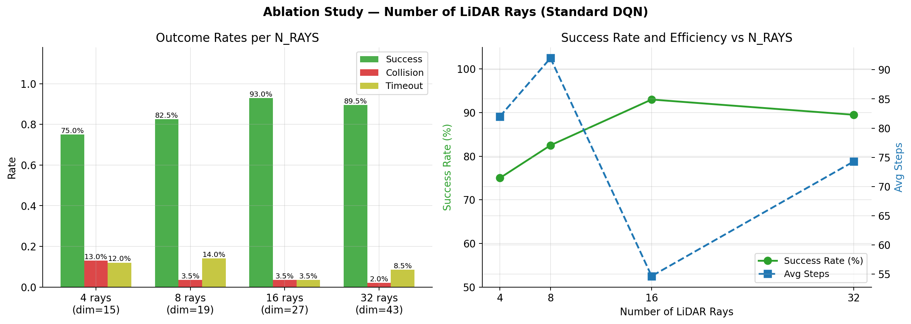
*SR increases monotonically from 4 to 16 rays. The slight decrease at 32 rays is due to harder training, not information saturation.*

The optimal configuration is **16 rays** (SR=93%). With 4 rays the agent has 90° angular coverage gaps; with 16 rays coverage every 22.5° is sufficient for effective navigation in the 600×600 environment.

| Model | Preview |
|:------|:--------|
| **4 Rays** |  |
| **8 Rays** |  |
| **16 Rays** |  |
| **32 Rays** |  |

### 7.3 Ablation: Obstacle Density

| N Obstacles | SR | CR | TR | Avg Steps | Avg Reward |
|------------|-----|-----|-----|-----------|------------|
| 2  | 97.5% | 1.5% |  1.0% | 43.9 | 9.61 |
| 4  | 94.0% | 2.0% |  4.0% | 55.0 | 9.22 |
| 6  | 95.0% | 1.5% |  3.5% | 54.7 | 9.33 |
| **8** | **93.0%** | **3.5%** | **3.5%** | **54.7** | **9.11** |
| 10 | 85.5% | 7.0% |  7.5% | 68.1 | 8.28 |
| 12 | 79.5% | 9.5% | 11.0% | 79.8 | 7.62 |

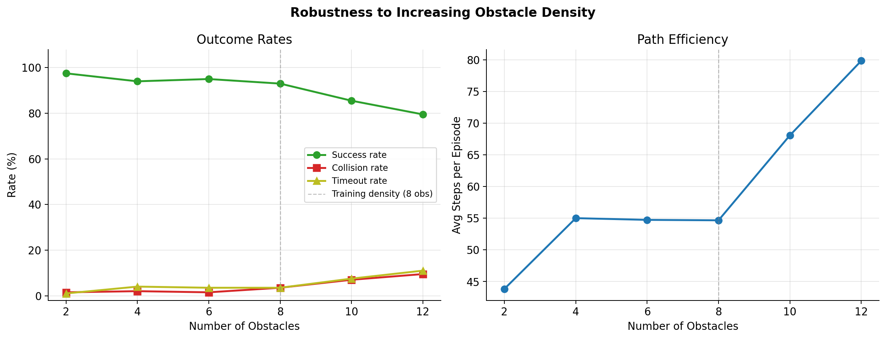
*Zero-shot generalisation to obstacle densities not seen in training. Graceful degradation up to 12 obstacles.*

The model generalises well to densities lower than the training value (97.5% with 2 obstacles). Beyond 8 obstacles the success rate degrades gradually, reaching 79.5% with 12.

| N Obstacles | Preview |
|:------------|:--------|
| **2** | 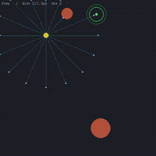 |
| **4** | 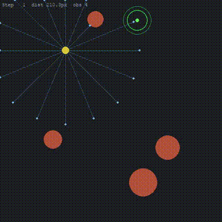 |
| **6** | 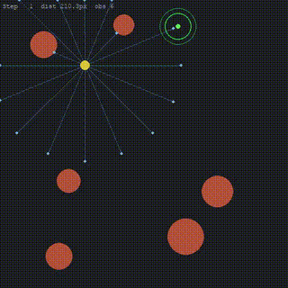 |
| **8 (training)** |  |
| **10** | 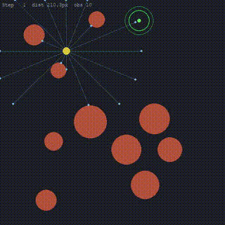 |
| **12** | 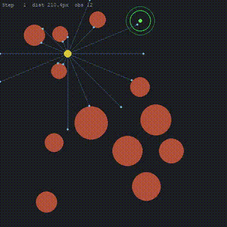 |

### 7.4 Ablation: LiDAR Noise

| Noise σ | SR | CR | TR | Avg Steps |
|--------|-----|-----|-----|-----------|
| 0.00 | 93.0% | 3.5% | 3.5% | 54.7 |
| 0.02 | 92.5% | 5.5% | 2.0% | 49.9 |
| 0.05 | 93.5% | 5.5% | 1.0% | 46.0 |
| 0.10 | 94.5% | 5.0% | 0.5% | 45.5 |
| 0.20 | 90.0% | 10.0% | 0.0% | 41.1 |

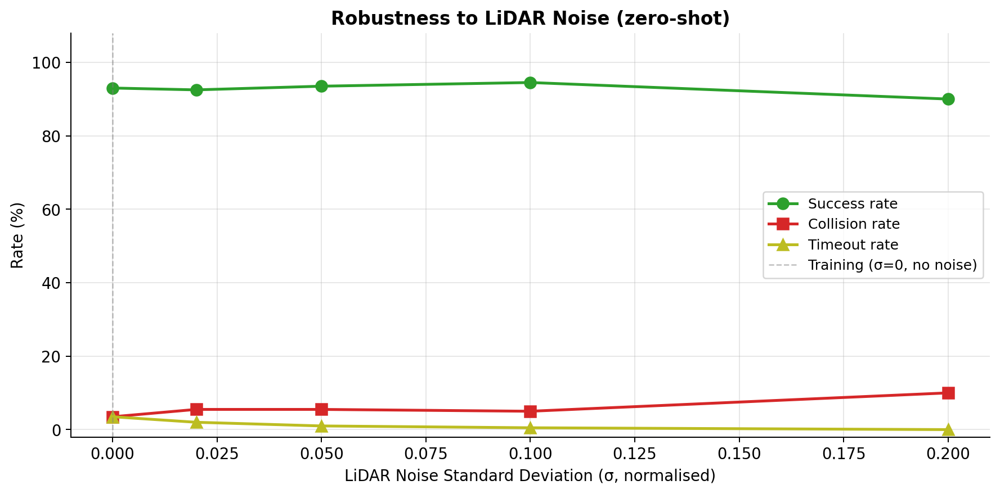
*The model remains above 90% SR up to σ=0.20 (20% of the LiDAR range).*

The model is highly robust to sensor noise, maintaining SR above 90% even at σ=0.20. The slight SR increase at σ=0.05–0.10 is attributed to noise smoothing spurious LiDAR readings at obstacle edges.

| Noise σ | Preview |
|:--------|:--------|
| **σ = 0.00** |  |
| **σ = 0.02** |  |
| **σ = 0.05** |  |
| **σ = 0.10** |  |
| **σ = 0.20** |  |

### 7.5 Ablation: Step Size

| Step Size | SR | CR | TR | Avg Steps |
|----------|-----|-----|-----|-----------|
| 4.0 px | 91.0% | 4.0% | 5.0% | 97.8 |
| 6.0 px | 89.5% | 6.0% | 4.5% | 69.7 |
| **8.0 px** | **93.0%** | **3.5%** | **3.5%** | **54.7** |
| 12.0 px | 91.0% | 5.0% | 4.0% | 42.0 |
| 16.0 px | 91.0% | 6.0% | 3.0% | 32.1 |

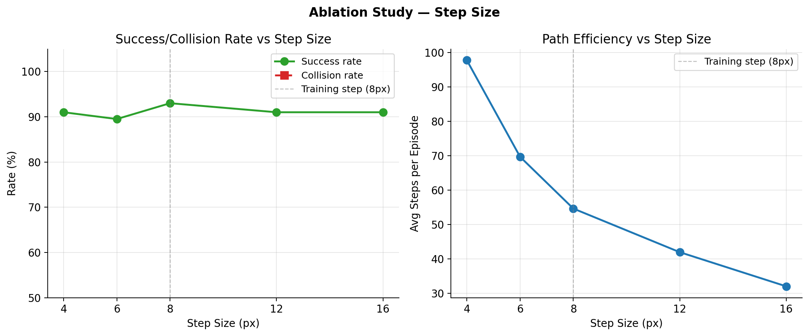
*The model generalises well to step sizes from 4 to 16 px (SR: 89.5%–93%).*

The model transfers well across step sizes not seen in training. Smaller steps require more steps to reach the goal (97.8 at 4 px vs 32.1 at 16 px) while maintaining comparable success rates.

| Step Size | Preview |
|:----------|:--------|
| **4 px** |  |
| **6 px** | 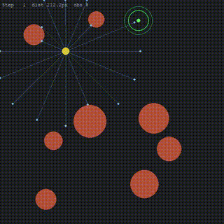 |
| **8 px (training)** |  |
| **12 px** |  |
| **16 px** |  |

### 7.6 Zero-Shot Generalisation to Obstacle Shapes

The model was trained exclusively on **circular** obstacles. Zero-shot evaluation on 4 polygon shapes never seen in training:

| Shape | SR | CR | TR | Avg Steps |
|-------|-----|-----|-----|-----------|
| Circle (training) | 93.0% | 3.5% | 3.5% | 54.7 |
| Rectangle | 78.0% | 11.5% | 10.5% | 79.6 |
| Rotated Rectangle | 82.0% | 8.5% | 9.5% | 76.3 |
| Triangle | 75.5% | 13.0% | 11.5% | 84.4 |
| L-Shape | 72.0% | 6.5% | 21.5% | 121.3 |

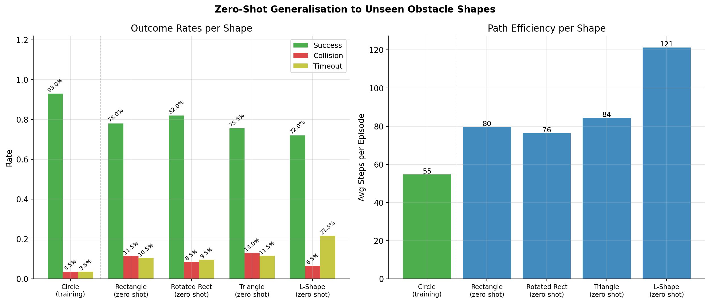
*Generalisation to unseen shapes. Performance remains above 72% across all shapes.*

The L-Shape (SR=72%, TR=21.5%) is the hardest: its concave region creates "pockets" where the agent gets trapped (average 121 steps vs 55 for circles). Convex shapes (rectangle: 78%, rotated rectangle: 82%) show better performance because their LiDAR profiles are closer to the circular obstacles seen in training.

---

## 8. Results

### Summary

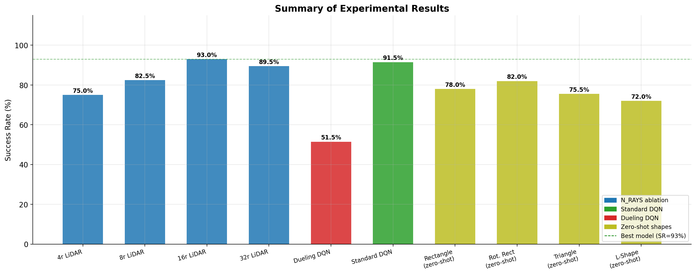
*Summary of all experimental results. Green dashed line: best model baseline (SR=93%).*

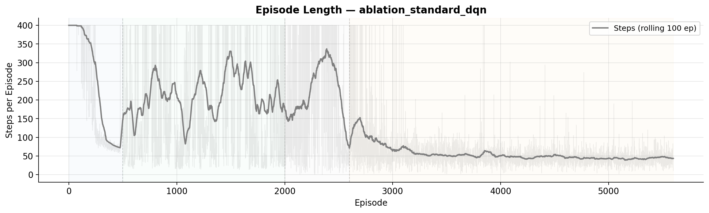
*Episode length during training — shorter episodes in Phase 2 indicate a more efficient navigation policy.*

| Experiment | Configuration | SR | Episodes |
|------------|--------------|-----|----------|
| **Main model** | Standard DQN, 16r, 8 obs | **93.0%** | 200 |
| Ablation rays — 4r | Standard DQN, 4 rays | 75.0% | 200 |
| Ablation rays — 8r | Standard DQN, 8 rays | 82.5% | 200 |
| Ablation rays — 32r | Standard DQN, 32 rays | 89.5% | 200 |
| Architecture — Dueling DQN | Dueling DQN, 16r | 51.5% | 200 |
| Robustness — 2 obs | Standard DQN, 16r | 97.5% | 200 |
| Robustness — 12 obs | Standard DQN, 16r | 79.5% | 200 |
| Robustness — noise σ=0.20 | Standard DQN, 16r | 90.0% | 200 |
| Zero-shot — rectangle | Standard DQN, 16r | 78.0% | 200 |
| Zero-shot — L-Shape | Standard DQN, 16r | 72.0% | 200 |

### Key Findings

1. **Standard DQN outperforms Dueling DQN by +40% SR** — the advantage stream introduces Q-value instability in this navigation task, contrary to the theoretical expectation.
2. **16 rays is the optimal configuration** — SR increases monotonically from 4r to 16r; the slight decrease at 32r reflects training difficulty, not information saturation.
3. **High robustness to unseen conditions** — the model generalises without retraining to varying obstacle densities (79.5%–97.5%), LiDAR noise (90% at σ=0.20) and step sizes (89.5%–93%).
4. **Partial zero-shot shape generalisation** — acceptable performance on convex shapes (78%–82%), lower on concave shapes (72%–75.5%).
5. **Curriculum Learning is essential** — without the phased curriculum the training does not converge; Phase 1.5 is critical for models with 16+ rays.

---

## 9. Conclusions

The project developed and validated a navigation agent based on Double DQN with curriculum learning, achieving **SR=93%** on random scenarios with 8 circular obstacles. Main methodological contributions:

- **Phase 1.5 as a distribution bridge**: eliminates the distribution shift between fixed-position curriculum and full generalisation.
- **Hyperparameter scaling by dimensionality**: LR, Phase 0 and TAU scaled by N_RAYS enable stable training across 4–32 rays.
- **Systematic fixes for Q-value divergence**: EPS_END=0.10 + buffer reset + grad clip + Phase 1.5 eliminates divergence seen in initial configurations.
- **Surprising architecture result**: Standard DQN outperforms Dueling DQN by 40 percentage points, suggesting that the additional complexity of Dueling DQN introduces instability not compensated by its theoretical advantage in this local navigation task.

---

## 10. Usage

### Training

```bash
# Main model (Standard DQN, 16 rays)
python src/train.py --exp_name run_main

# With Dueling DQN
python src/train.py --exp_name run_dueling

# Custom configuration
python src/train.py --exp_name run_4r --n_rays 4 --seed 42
```

### Evaluation with Visual Rendering

```bash
# Watch the agent navigate in pygame
python src/evaluate.py --checkpoint checkpoints/run_main/best.pt --render

# Slow motion for analysis
python src/evaluate.py --checkpoint checkpoints/run_main/best.pt --render --fps 5

# Harder scenario
python src/evaluate.py --checkpoint checkpoints/run_main/best.pt --n_obstacles 12
```

### Full Experiment Suite

```bash
# LiDAR ray ablation (Standard DQN — 4 full training runs)
python src/run_experiments.py --exp ablation_rays --no_dueling

# Robustness ablation (uses existing model)
python src/run_experiments.py --exp ablation_obstacles \
    --base_checkpoint checkpoints/ablation_rays_16r/best.pt

python src/run_experiments.py --exp ablation_noise \
    --base_checkpoint checkpoints/ablation_rays_16r/best.pt

python src/run_experiments.py --exp ablation_stepsize \
    --base_checkpoint checkpoints/ablation_rays_16r/best.pt

# Zero-shot on unseen shapes
python src/run_experiments.py --exp shapes \
    --base_checkpoint checkpoints/ablation_rays_16r/best.pt

# Dueling vs Standard DQN comparison
python src/run_experiments.py --exp dueling_vs_dqn
```

### Generate Plots

```bash
# All 13 plots at once
python src/plot_metrics.py --mode all --results_dir results --out_dir plots

# Individual plots
python src/plot_metrics.py --mode training \
    --results_dir results/ablation_standard_dqn --out_dir plots

python src/plot_metrics.py --mode ablation_rays \
    --json results/ablation_rays.json --out_dir plots

python src/plot_metrics.py --mode q_divergence \
    --results_dir results --out_dir plots

python src/plot_metrics.py --mode summary \
    --results_dir results --out_dir plots
```

---

## 11. References

- Mnih, V. et al. (2015). *Human-level control through deep reinforcement learning*. Nature, 518, 529–533.
- Van Hasselt, H., Guez, A., & Silver, D. (2016). *Deep reinforcement learning with double Q-learning*. AAAI.
- Wang, Z. et al. (2016). *Dueling network architectures for deep reinforcement learning*. ICML.
- Sutton, R. S., & Barto, A. G. (2018). *Reinforcement Learning: An Introduction* (2nd ed.). MIT Press.
- Schaul, T. et al. (2016). *Prioritized experience replay*. ICLR.

---

*Environment: Python 3.11, PyTorch 2.x (CUDA), NumPy, Pygame, Matplotlib*